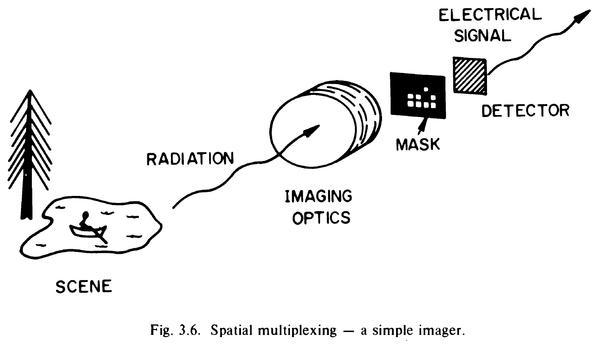
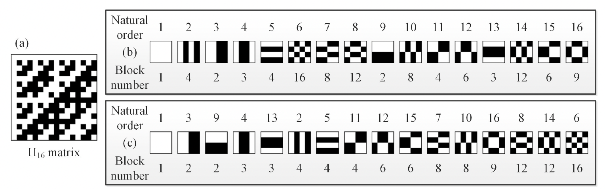

# Hadamard Pattern Single Pixel Imaging

## Single Pixel Imaging (SPI)

멀티픽셀 이미징이 불가능한 경우(ex 테라헤르츠 이미지) 사용하는 기법. 

원본 이미지 픽셀 하나하나의 정보를 masking pattern 하나에 1대 1 대응을 시키는 것. 마스킹을 통과한 빛의 intensity 를 측정하고, intensity 를 해당 마스킹 패턴에 weight 로 줘서 합치면 원본 이미지를 얻어낼 수 있다.

## Hadamard Pattern

$$
H_{2^n}=\begin{bmatrix}H_{2^{n-1}} & H_{2^{n-1}}\\
H_{2^{n-1}} & -H_{2^{n-1}}\end{bmatrix}
$$
$$
H_{2^1}=\begin{bmatrix}1 & 1\\
1 & -1\end{bmatrix}
$$

각 row 들끼리 orthogonal 한 행렬. 이때 $HH=nI$ 이므로, 원본 이미지를 flatten(2D 매트릭스를 1D 로 쭉 펴는것)한 벡터를 x, 관측된 이미지를 y 라 하면 $y=Hx$ 이므로. $H^{-1}y=Hy=x$ 이다. (factor n은 편의상 생략)

즉 각 row 를 2D 매트릭스 마스킹 패턴으로 만들고, 마스킹 패턴과 원본 2D 이미지를 element-wise multiplication 한 것(실험에선 디텍터에 관측되는 intensity)을 weight 로 삼으면 원본 이미지를 재구성할 수 있는 것.

### Reconstruction using Hadamard Patterns

각 row 를 masking pattern 으로 사용할 것이다. 각 row 를 정사각형 마스킹 패턴으로 만드는 것은 flatten 과정의 반대.

ex) 
$$
H_4 = \begin{bmatrix}
1 & 1 &1 &1\\
1 & -1 &1 &-1\\
1 & 1 &-1 &-1\\
1 & -1 &-1 &1
\end{bmatrix}
$$
1행, 2행, 3행, 4행을 이용한 마스킹 패턴은 
$$
\begin{bmatrix}
1 & 1 \\
1 & 1 \\
\end{bmatrix},
\begin{bmatrix}
1 & 1 \\
-1 & -1 \\
\end{bmatrix},
\begin{bmatrix}
1 & -1 \\
1 & -1 \\
\end{bmatrix},
\begin{bmatrix}
1 & -1 \\
-1 & 1 \\
\end{bmatrix}
$$

따라서 single pixel imaging(SPI) 기법으로 N x N 이미지를 재구성하고 싶다면 $N^2 \times N^2$ 크기의 하다마드 행렬을 만든뒤 마스킹 패턴을 구축해야한다.

## Compressed Sensing

이미지를 100% 완벽하게 재구성하기 위해서는 계산량이 너무 많아진다. 그래서 마스킹 패턴중 일부만 사용해서 이미지를 재구성하는 것.

그럼 어떤 마스킹 패턴을 뽑아서 사용할 것이냐, 마스킹 패턴에 어떤 ordering 을 주느냐가 관건.

Cake-Cutting ordering 은 마스킹 패턴에서 분절된 영역의 갯수가 적은 순서부터 나열하는 것.

위쪽은 일반적인 하다마드 오더. 아래쪽은 cake-cutting 오더. 분절된 영역의 갯수(블록 넘버) 숫자에 따라 오더링을 한 것.

하다마드 패턴에서 네츄럴 오더 순으로 앞의 10%만 뽑아서 이미지를 재구성 하면 원본을 알아볼 수 없는 이미지가 되지만, CC ordering 의 경우 앞의 10% 만 뽑아도 대강의 형태는 알아볼 수 있고, 33% 정도만 뽑아도 꽤 괜찮은 품질의 이미지가 재구성 된다. 

ex) 64 x 64 이미지를 재구성하고 싶다면 4096x4096 크기의 하다마드 매트릭스를 만들고, 매트릭스 각 row 를 통해 4096개의 하다마드 마스킹 패턴들을 만든다. 그다음 각 패턴의 블록 넘버 숫자를 계산하고, 오더링을 하고, 10% 정도를 샘플링(약 400개의 패턴을 뽑아서 사용) 한다음, 원본 이미지를 마스킹 패턴에 프로젝션하고(element-wise multiplication), 프로젝션한 행렬의 모든 성분값을 더한걸 weight 로 한 뒤 이미지를 재구성한다.

## Reference

Single-pixel imaging 12 years on: a review (2020)
GRAHAM M. GIBSON,1,2 STEVEN D. JOHNSON,1,3 AND MILES J. PADGETT